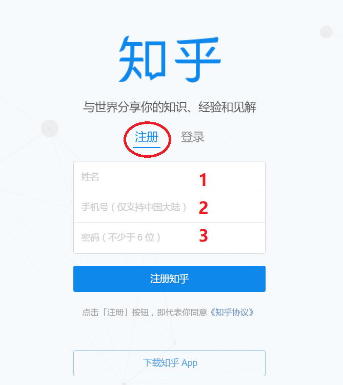
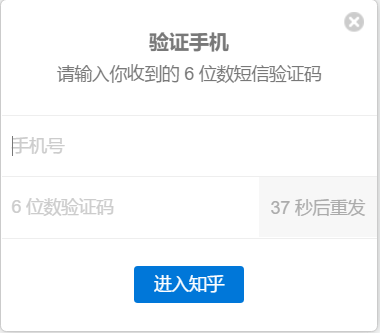
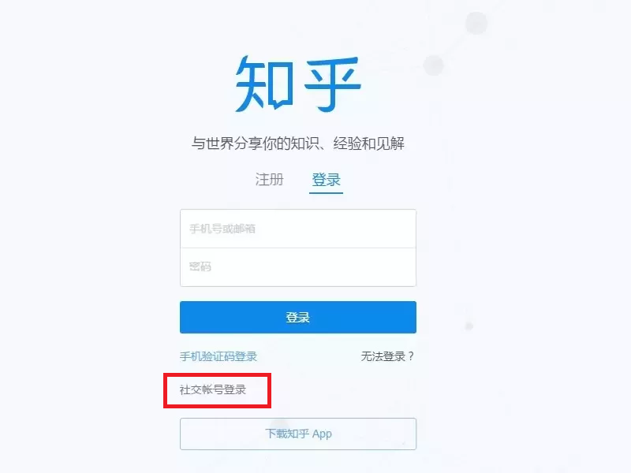
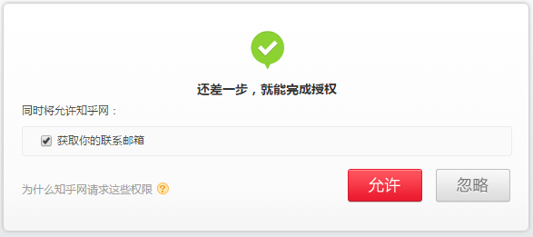
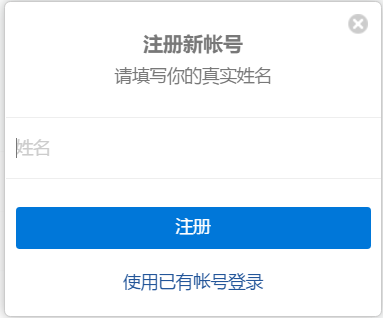

Well, you don't have to be a Chinese citizen, but you'll need something:

1. a cell phone number, and it has to be one from Mainland China, i.e. one that starts with +86 followed by 11 digits (yeah, we have a huge population), **or**
2. an SNS account with either  **WeChat (微信), Weibo (微博), or QQ**. 

If you have none of those things, sorry, I know no other way around. At one time you could sign up with just an email address, but they have changed the policy. So, either get a cell phone number or consider getting any one of those SNS accounts (I would suggest a Weibo (微博) account, for the other two may insist that you provide a cell phone number anyway), or you could just quit the idea. It's just another online community, no big deal. 

Now let's go through the steps. Remember, they are two separate approaches: just pick one that suits you. You don't have to do both.

### 1. Signup with a cell phone number

From the page you have opened, click on the circled characters, and you'll see a three-row table:

Enter your name in Row 1, your cell phone number in Row 2, and your password (at least six characters) in Row 3. Click on the long blue bar, which says "Sign up for Zhihu". A six-digit code will be sent to your cell phone, and on the next page, you'll be requested to verify your cell phone number with the code. 

Again, one the first row, enter your cell phone number, and the code on the second. See that gray area with a number (37 in the screenshot). That's a one-minute countdown. In case you don't receive the code, click on it to request a re-send. 

Click on the blue bar, which says "Enter Zhihu". You are almost done through the process. But before you literally enter Zhihu, you'll be asked about your profession, and then your area of interest, and voila, there you are. 

### 2. Login with an SNS account

From the page you have opened (the login page), see that area in the red rectangle? That's the option of logging in with an SNS account.

Click on it, and the three options will pop up in the order of WeChat-Weibo-QQ. Choose the one you have an account with, and you will be directed to a corresponding login page. Three things may happen:

1. You have logged into that account on your browser, or your cell phone. If so, the login process takes care of itself, and you may just see a flash of a certain page. 

2. The page with a QR code pops up. Scan it with your WeChat or QQ app.

3. For Weibo, you'll see a login page with two boxes. Enter your account in the first box, your password in the second, and then click one the button that follows. You'll see an additional page that requests access to your email address:

   

Uncheck the box if you deny such access (but Zhihu may ask for one later anyone). Whatever you decision, click on the red button, which says ALLOW, to proceed. Or the white one, which says IGNORE.

The next page asks you to enter your name. It says "Please enter your real name", but don't be fooled, you could fill in any name you prefer. In fact, any English name is by default a fake name, since they expect you to be Chinese. Click the long blue bar, which says SIGNUP, to continue.

You'd think you are done? Not yet. But let's gather pace, the next page requests your profession, do it; then topics you are interested, just click on a few boxes, and then the blue bar. And you are done, finally! Phew!

It isn't really that complicated though. It takes a fraction of second to go through each page, but explaining everything is killing me.

P. S. If your Chinese isn't good enough to make sense of this signup/login process, browsing all the stuff won't be easy task for you. Notwithstanding, I appreciate your effort in learning Chinese, and I do think it necessary to submerge in the real world of the Chinese language. Just don't get disheartened if you don't understand much of the Chinese you see there. Remember, this it the Internet. Expect a lot of coinage. And a lot of grammar errors.

P. P. S. You can answer questions in English. Some people do write answers entirely in English. In fact, English learning is one of the hottest topics there, if not simply the hottest. So, if you have some good advice to offer, you could be big. But don't be surprised if you encounter something like, *Hey, here comes annother fake Laowai!* 

